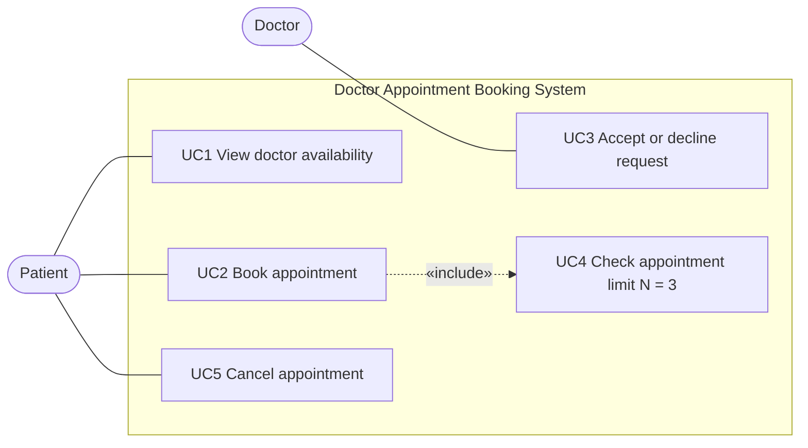

# Use Case Diagram

```mermaid
flowchart LR
    P([Patient])
    D([Doctor])

    subgraph DAB["Doctor Appointment Booking System"]
        UC1[UC1 View doctor availability]
        UC2[UC2 Book appointment]
        UC3[UC3 Accept or decline request]
        UC4[UC4 Check appointment limit N = 3]
        UC5[UC5 Cancel appointment]
    end

    P --- UC1
    P --- UC2
    P --- UC5
    D --- UC3
    UC2 -.->|"«include»"| UC4
```

- Actors stand outside the system box; use cases are inside.
- UC4 has no actor: it is included in UC2 (requirement R4).
